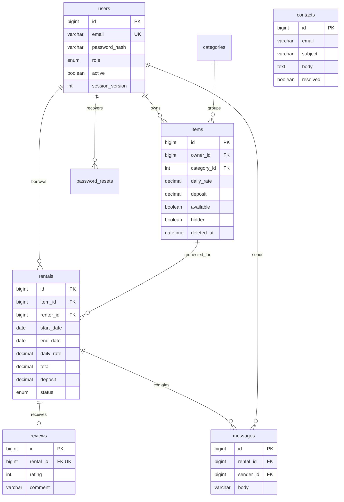

# BorrowHub data model

Contacts do not require an account. Rental prices are snapshots, not live references to listing prices. Soft-deleted listings retain their relations. Reviews have a unique rental key so a completed rental can receive only one borrower review.
